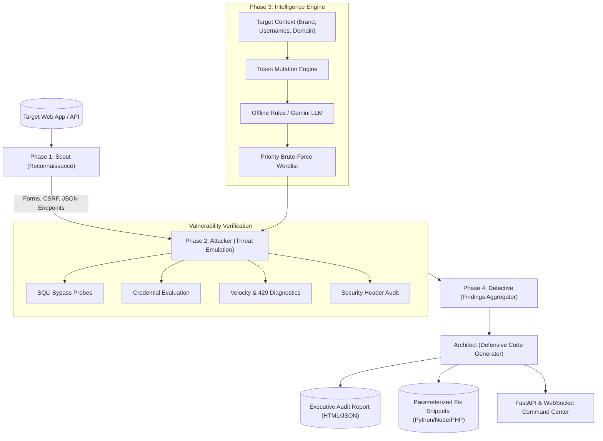

# 🛡️ SENTINAL-AI
### Autonomous Authentication Auditing, Credential Intelligence & Automated Remediation Platform
**Engineered and Architected by [Afran Layesh](https://github.com/afranlayesh) for the 2026 Cybersecurity Hackathon**

[](https://www.python.org/)
[](https://fastapi.tiangolo.com/)
[](https://owasp.org/)
[](https://pages.nist.gov/800-63-3/sp800-63b.html)
[](https://developer.mozilla.org/en-US/docs/Web/API/WebSockets_API)
[](#-legal--ethical-disclaimer)

---

## ⚡ Executive Overview

Modern web applications and microservices are heavily exposed at their authentication boundaries. While legacy vulnerability scanners identify potential flaws with high false-positive rates and offer vague remediation advice, **Sentinal-AI** bridges the critical divide between **offensive penetration testing** and **automated defensive engineering**.

Sentinal-AI is an end-to-end autonomous security platform capable of crawling dynamic Single Page Applications (SPAs), traditional server-rendered HTML forms, and modern JSON REST APIs. It executes non-destructive security probes against authentication mechanisms, measures rate-limiting thresholds, evaluates contextual password entropy, and **automatically synthesizes framework-specific, copy-pasteable parameterized code patches** (Python, Node.js, PHP, Nginx) aligned directly with **OWASP Top 10 (2021)** and **NIST SP 800-63B** guidelines.

```
       [ Phase 1: SCOUT ]           ──▶  Endpoint & CSRF Discovery
              │
       [ Phase 2: ATTACKER ]        ──▶  Non-Destructive SQLi & Velocity Probing
              │
       [ Phase 3: INTELLIGENCE ]    ──▶  Context-Aware Linguistic Password Mutations
              │
       [ Phase 4: ARCHITECT ]       ──▶  Automated Code-Level Defensive Patches
```

---

## 🚀 Key Platform Capabilities

### 🎯 1. Multi-Target Audit Architecture
* **Traditional HTML Form Targets:** Automated crawling, DOM parsing, extraction of anti-CSRF tokens (`csrf_token`, `_token`, hidden inputs), and automated session cookie persistence (compatible with DVWA, Mutillidae, WebGoat).
* **Modern JSON REST APIs:** Automatic fingerprinting of REST login routes (such as OWASP Juice Shop `/rest/user/login` or custom microservices) evaluating JSON payload boundaries, JWT bearer issuance, and schema error handling.
* **Single Page Applications (SPAs):** Capable of inspecting dynamic JavaScript frontends and client-side token exchanges.

### 💉 2. Non-Destructive SQL Injection Engine (SQLi)
* Probes authentication parameters with precision, non-destructive payloads designed to test authentication bypass logic without corrupting production databases.
* Covers **SQLite, MySQL, PostgreSQL, Boolean tautologies (`' OR 1=1--`), prefix variants (`admin'--`), semicolon terminators, and UNION probes**.
* Evaluates both parameter-based form submissions and raw JSON payloads.

### 🔒 3. Credential Stuffing & Rate-Limiting Diagnostics
* High-velocity burst analysis to identify missing or inadequate anti-automation controls (**OWASP A04:2021** & **CWE-307**).
* Calculates exact velocity metrics (requests per second, response latency degradation, and HTTP 429 Too Many Requests enforcement).
* Evaluates account lockout resistance, exponential backoff, and distributed brute-force resilience.

### 🧠 4. Context-Aware Password Intelligence Engine
* Applies linguistic token mutations and entropy generation rules tailored to target metadata:
  * Company name variations (capitalization, leetspeak, symbol additions).
  * Domain parts and brand tokens.
  * Year stamps (`2024`, `2025`, `2026`).
  * Common keyboard walks and regional administrative defaults.
* Operates entirely offline with zero mandatory API costs, while supporting optional live **Google Gemini LLM** API integration.

### 🔐 5. Multi-Algorithm Hash Recovery Suite
* High-throughput cryptographic recovery engine for password audit verification.
* Built-in support for **MD5, SHA-1, SHA-256, SHA-512, and NTLM**.
* Automatic fallback to **GPU-accelerated Hashcat** pipelines when available.

### 🛡️ 6. Automated Defensive Patch Generator (Architect)
* Translates identified vulnerabilities into concrete, deployable code refactors across multiple stacks:
  * **Python:** SQLAlchemy ORM parameterization, Flask-Limiter Redis sliding window rate limits, `zxcvbn` password strength checks.
  * **Node.js:** `mysql2`/`pg` prepared statement refactors, `express-rate-limit` middleware configs.
  * **PHP:** PDO prepared statements with bounded parameters.
  * **Nginx:** `limit_req_zone` reverse proxy rate-limiting directives.
* Generates executive HTML vulnerability deliverables with CVSS v3.1 scoring.

### 💻 7. Modern Cyber Command Center Dashboard
* Dark obsidian glassmorphism interface styled with HSL tailored palettes and ambient canvas animations.
* Real-time bidirectional WebSocket telemetry streaming engine output line-by-line.
* One-click **Remediation Fix Advisor Modals** providing instant copy-pasteable code fixes.
* Interactive report archiving with one-click print-ready HTML/PDF report downloads.

---

## 📂 System Architecture

Sentinal-AI is modularized into four decoupled phases:



---

## 🛠️ Installation & Setup

### Prerequisites
* **Python 3.10+** (Python 3.11 recommended)
* **Git**
* Windows, Linux, or macOS

### 1. Clone the Repository
```bash
git clone https://github.com/afranlayesh/Sentinal-AI.git
cd Sentinal-AI
```

### 2. Create and Activate a Virtual Environment
```bash
# Windows (PowerShell)
python -m venv .venv
.\.venv\Scripts\Activate.ps1

# Linux / macOS
python3 -m venv .venv
source .venv/bin/activate
```

### 3. Install Dependencies
```bash
pip install -r requirements.txt
```

---

##  Running the Platform

### 1. Launch the Command Center Web Dashboard
Start the FastAPI server and WebSocket telemetry backend:
```bash
python server.py
```
Open your browser and navigate to:
👉 **`http://127.0.0.1:8000`**

From the dashboard you can:
* Enter any local or remote target URI.
* Toggle active modules (SQLi, Credential Stuffing, Rate Limiting, AI Mutation).
* Watch live colored execution telemetry via WebSockets.
* Inspect discovered vulnerabilities and launch the **Fix Advisor** for code patches.
* Run cryptographic hash analysis.
* Export executive vulnerability reports.

---

### 2. Running the Offline Test Lab (Self-Contained Mock Target)
Sentinal-AI includes a zero-dependency, self-contained vulnerable server for offline penetration testing and demonstration:
```bash
python lab/mock_server.py
```
* Runs on **`http://127.0.0.1:5000`**.
* Simulates:
  * OWASP Juice Shop REST API (`/rest/user/login` with JWT tokens and SQLite injection).
  * Traditional PHP/HTML login forms with CSRF token protection.
  * Rate-limited endpoints for anti-automation evaluation.

---

### 3. Command Line Interface (CLI) Usage

You can also run automated scans directly from your terminal:

#### A. Full Security Audit on Local or Remote Target:
```bash
python main.py scan --url http://127.0.0.1:5000 --ai -c "Sentinal Lab" -u "admin"
```

#### B. Audit an OWASP Juice Shop Instance:
```bash
python main.py scan --url http://localhost:3000
```

#### C. Custom Module Selection:
```bash
# Run only SQL Injection and Rate Limit checks (skip credential stuffing):
python main.py scan --url http://127.0.0.1:5000 --no-brute

# Run only Credential Stuffing with AI Mutation:
python main.py scan --url http://127.0.0.1:5000 --no-sqli --no-ratelimit --ai -c "Acme Corp"
```

#### D. Crack Leaked Password Hashes:
```bash
# CPU multi-threaded cracking:
python main.py crack --hash 5f4dcc3b5aa765d61d8327deb882cf99

# GPU accelerated Hashcat cracking:
python main.py crack --hash 5f4dcc3b5aa765d61d8327deb882cf99 --gpu
```

---

## 📖 CLI Flag Reference

| Flag | Type | Default | Description |
| :--- | :---: | :---: | :--- |
| `--url` | String | *Required* | Target base URL, login form URL, or REST route |
| `--ai / --no-ai` | Flag | `--ai` | Enable contextual password mutation intelligence |
| `--sqli / --no-sqli` | Flag | `--sqli` | Enable/disable SQL injection verification |
| `--brute / --no-brute` | Flag | `--brute` | Enable/disable credential stuffing emulation |
| `--ratelimit / --no-ratelimit` | Flag | `--ratelimit` | Enable/disable rate-limiting burst velocity testing |
| `-c, --company` | String | `None` | Organization name for contextual password mutations |
| `-u, --usernames` | String | `admin` | Comma-separated list of target accounts to evaluate |
| `--api-login` | String | `None` | Explicit JSON API authentication route (e.g. `/api/auth`) |
| `--max-pages` | Int | `5` | Maximum depth for web crawler crawling authentication forms |
| `--hash` | String | `None` | Target hash string to identify and recover |
| `--gpu` | Flag | `False` | Use GPU-accelerated Hashcat runner |
| `--wordlist` | Path | `rockyou.txt` | Custom wordlist path for dictionary recovery |

---

## 🛡️ Automated Defensive Remediation (Architect)

When Sentinal-AI identifies an authentication vulnerability, the **Architect Engine** immediately outputs verified, framework-specific code patches:

### Example: SQL Injection Remediation (OWASP A03:2021)
#### Vulnerable Code Pattern:
```python
# VULNERABLE: Direct string interpolation
cursor.execute(f"SELECT * FROM users WHERE email = '{email}' AND password = '{password}'")
```

#### Sentinal-AI Defensive Patch (Python / SQLAlchemy):
```python
# REMEDIATION: Parameterized prepared statement
stmt = select(User).where(User.email == email, User.password == hashed_password)
result = session.execute(stmt).scalar_one_or_none()
```

#### Sentinal-AI Defensive Patch (Node.js / Prepared):
```javascript
// REMEDIATION: Parameter binding prevents SQL injection
const [rows] = await db.execute(
  'SELECT id, email, role FROM users WHERE email = ? AND password_hash = ?',
  [email, hashedPassword]
);
```

---

### Example: Rate Limiting Enforcement (OWASP A04:2021)
#### Sentinal-AI Defensive Patch (Python Flask-Limiter / Redis):
```python
from flask_limiter import Limiter
from flask_limiter.util import get_remote_address

limiter = Limiter(key_func=get_remote_address, storage_uri="redis://localhost:6379")

@app.route('/api/login', methods=['POST'])
@limiter.limit("5 per minute")
def login():
    # Login verification logic
    ...
```

#### Sentinal-AI Defensive Patch (Nginx Reverse Proxy):
```nginx
# Nginx Rate Limiting Directive
limit_req_zone $binary_remote_addr zone=login_limit:10m rate=5r/m;

location /rest/user/login {
    limit_req zone=login_limit burst=3 nodelay;
    proxy_pass http://backend_server;
}
```

---

## 📡 REST & WebSocket API Documentation

The FastAPI backend exposes comprehensive REST endpoints and real-time WebSockets:

| Method | Endpoint | Description |
| :--- | :--- | :--- |
| `GET` | `/` | Serves the cyber command center dashboard UI |
| `GET` | `/api/status` | Returns core engine operational status and scan state |
| `POST` | `/api/scan` | Initiates an asynchronous penetration testing audit |
| `POST` | `/api/crack` | Executes cryptographic hash cracking |
| `GET` | `/api/findings` | Lists all historical vulnerability audit archives |
| `GET` | `/api/findings/{filename}` | Retrieves full JSON telemetry for a specific audit |
| `GET` | `/api/reports/{filename}/export` | Generates a printable, executive HTML audit report |
| `WS` | `/ws` | Real-time WebSocket channel for log streaming and telemetry |

---

## 🏛️ Project Directory Structure

```text
Sentinal-AI/
├── attacker/                    # Phase 2 Threat Emulation Modules
│   ├── brute_force.py           # CSRF-aware credential evaluation
│   ├── detective.py             # Findings aggregation and CVSS calculation
│   ├── generic_api_adapter.py   # REST API authentication probe adapter
│   ├── juice_shop_adapter.py    # OWASP Juice Shop REST API adapter
│   ├── passive_auditor.py       # Passive security header evaluation
│   ├── rate_limiting.py         # Velocity and anti-automation diagnostics
│   └── sqli_engine.py           # Precision SQL injection verification engine
├── core/                        # Global Platform Configuration
│   ├── banner.py                # ANSI terminal banner art
│   ├── config.py                # Environment variables and engine thresholds
│   └── logger.py                # Standardized system logging handler
├── frontend/                    # Web Command Center Dashboard
│   ├── index.html               # Semantic HTML5 dashboard structure
│   └── static/
│       ├── app.js               # WebSocket client & dashboard controller
│       └── style.css            # Dark obsidian glassmorphism design system
├── intelligence/                # Phase 3 Password Intelligence Engine
│   ├── ai_guesser.py            # Local mutation rule engine & Gemini LLM hook
│   ├── context_builder.py       # Target metadata & token extraction
│   ├── db_bridge.py             # Internal credential database connector
│   └── wordlist_merger.py       # Wordlist prioritization and deduplication
├── lab/                         # Offline Vulnerable Target Lab
│   ├── cracker.py               # Multi-algorithm CPU hash recovery
│   ├── hashcat_runner.py        # GPU-accelerated Hashcat driver
│   ├── identifier.py            # Hash algorithm pattern detector
│   ├── mock_server.py           # Self-contained vulnerable mock web server
│   └── wordlists/               # Curated penetration testing dictionaries
├── reports/                     # Phase 4 Automated Defensive Remediation
│   └── architect.py             # Defensive code patch compiler & HTML reporter
├── main.py                      # CLI Entry Point
├── server.py                    # FastAPI Web Server & WebSocket Daemon
├── requirements.txt             # Project Python Dependencies
└── README.md                    # Platform Documentation
```

---

## ⚖️ Standards & Compliance Alignment

Sentinal-AI strictly correlates every finding to international cybersecurity frameworks:

* **OWASP Top 10:2021:**
  * **A03:2021 — Injection:** Parameter tampering, tautology evaluation, SQL error detection.
  * **A04:2021 — Insecure Design:** Rate limiting absence, lack of velocity throttling.
  * **A05:2021 — Security Misconfiguration:** Missing security headers (HSTS, CSP, X-Frame-Options).
  * **A07:2021 — Identification and Authentication Failures:** Default credentials, weak passphrases.
* **NIST SP 800-63B:** Digital Identity Guidelines for authenticators, password complexity, and brute-force mitigation.
* **CWE Standards:** CWE-89 (SQLi), CWE-307 (Improper Restriction of Excessive Auth Attempts), CWE-521 (Weak Password Requirements), CWE-319 (Cleartext Transmission).

---

## 🗺️ Vision & Future Architecture Roadmap

Sentinal-AI is evolving from an authentication & credential intelligence engine into a complete **autonomous red-team and continuous vulnerability management platform**.

```
                        ┌──────────────────────────────────────────────┐
                        │          SENTINAL-AI CORE ENGINE             │
                        └───────┬──────────────────────────────┬───────┘
                                │                              │
                ┌───────────────▼──────────────┐ ┌─────────────▼───────────────┐
                │   NETWORK & HOST DISCOVERY   │ │    APPLICATION & API AUDIT  │
                ├──────────────────────────────┤ ├─────────────────────────────┤
                │ • Nmap (NSE & Port Scanner)  │ │ • Crawler & Form Parser     │
                │ • Legion (Automated Recon)   │ │ • OWASP Juice Shop Adapter  │
                │ • Banner & Service Prober    │ │ • Nuclei Template Runner    │
                └───────────────┬──────────────┘ └─────────────┬───────────────┘
                                │                              │
                                └───────────────┬──────────────┘
                                                │
                                ┌───────────────▼──────────────┐
                                │      AI CORRELATION &        │
                                │    DEFENSIVE REMEDIATION     │
                                ├──────────────────────────────┤
                                │ • Gemini / Local Mutation    │
                                │ • Auto-Remediation (Fixes)   │
                                │ • Executive HTML / PDF Audit │
                                └──────────────────────────────┘
```

### 1. 🌐 Network Layer & Infrastructure Discovery (Nmap Integration)
* **High-Speed Port Auditing:** Integrated port discovery utilizing raw SYN scans and TCP connect sweeps.
* **Service & OS Fingerprinting:** Automated service version extraction (`nmap -sV -O`) to detect outdated daemons (OpenSSH, Apache, Nginx, Redis, PostgreSQL).
* **Nmap Scripting Engine (NSE):** Trigger targeted NSE scripts (`vuln`, `auth`, `ssl-enum-ciphers`) with results piped directly into the Sentinal-AI real-time telemetry feed.
* **Pure Python Socket Fallback:** Native non-blocking asynchronous socket scanner for zero-dependency execution in cloud containers where external binaries are restricted.

### 2. 🛡️ Autonomous Service Enumeration (Legion Framework)
* **Multi-Protocol Reconnaissance:** Automated enumeration across non-HTTP services including SMB/Samba, FTP, SSH, SMTP, and LDAP.
* **Extensible Tool Orchestration:** Pluggable adapter pipeline orchestrating industry-standard tools (Nikto, SSLyze, Gobuster, Hydra, WhatWeb) through a unified API.
* **Dynamic Attack Vectors:** Automatic pivoting from network discoveries into application-layer exploitation.

### 3. ⚡ Continuous Vulnerability & Template Engine (Nuclei Integration)
* **Community CVE Rules:** Ingest community-driven YAML templates for zero-day and n-day vulnerabilities.
* **Cloud Security Posture:** Expanding assessments to include cloud storage misconfigurations (AWS S3, GCP Buckets, Azure Blobs).

### 4. 🤖 Autonomous Multi-Agent Red-Teaming
* **Self-Refining Exploration:** Autonomous agent that reads target responses, formulates customized attack hypotheses, and iterates until defense boundaries are mapped.
* **Zero-Touch Remediation Pull Requests:** Automatic generation of Git patches and PRs for developers to immediately patch identified vulnerabilities.

---

## 👨‍💻 Author & Project Credits

* **Lead Architect & Developer:** **[Afran Layesh](https://github.com/afranlayesh)**
* **GitHub Profile:** [@afranlayesh](https://github.com/afranlayesh)
* **LinkedIn Profile:** [Afran Layesh](https://linkedin.com/in/afran-layesh)
* **Project Mission:** Engineered for the **2026 Cybersecurity Hackathon Competition** to demonstrate how autonomous AI systems can eliminate authentication vulnerabilities and empower software engineers with automated defensive patches.

---

## ⚖️ Legal & Ethical Disclaimer

> [!CAUTION]
> **CRITICAL LEGAL NOTICE:** Sentinal-AI is designed and distributed **strictly for educational research, academic defense demonstrations, and authorized security assessments**.
>
> 1. **Explicit Permission Required:** Do not execute scans, attacks, or security evaluations against web applications, servers, or APIs that you do not own or for which you do not possess explicit, written penetration testing authorization from the verified system owner.
> 2. **Limitation of Liability:** The author (**Afran Layesh**) assumes **no liability or responsibility** for any misuse, unauthorized access, service interruption, legal infringement, or damages caused through the use or misuse of this software.
> 3. **Operator Responsibility:** Compliance with all local, state, federal, and international cybersecurity laws (including the **U.S. Computer Fraud and Abuse Act (CFAA)**, the **UK Computer Misuse Act**, and **GDPR**) remains the sole and exclusive responsibility of the operator.
